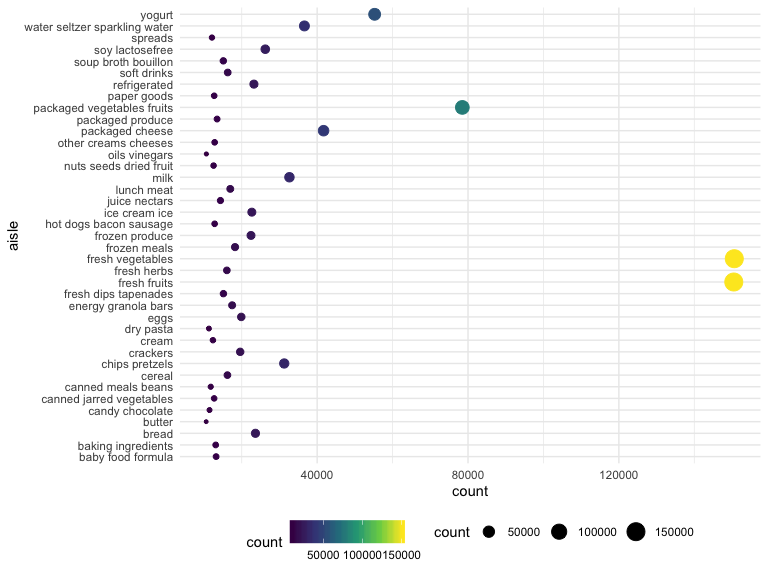
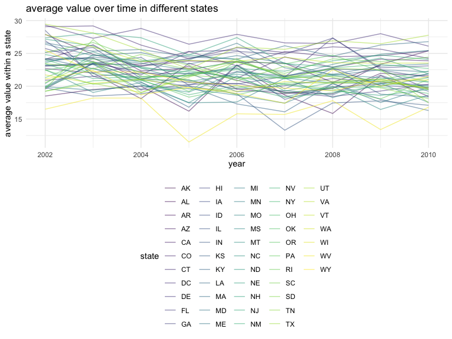
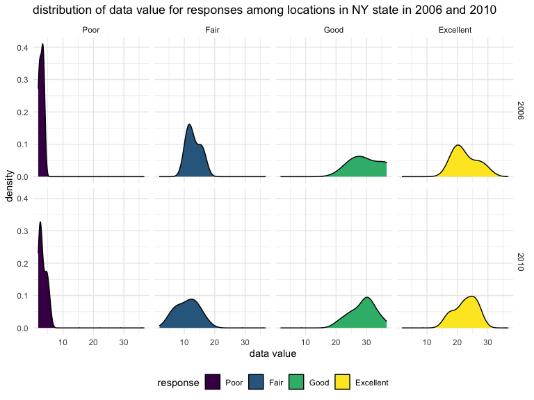
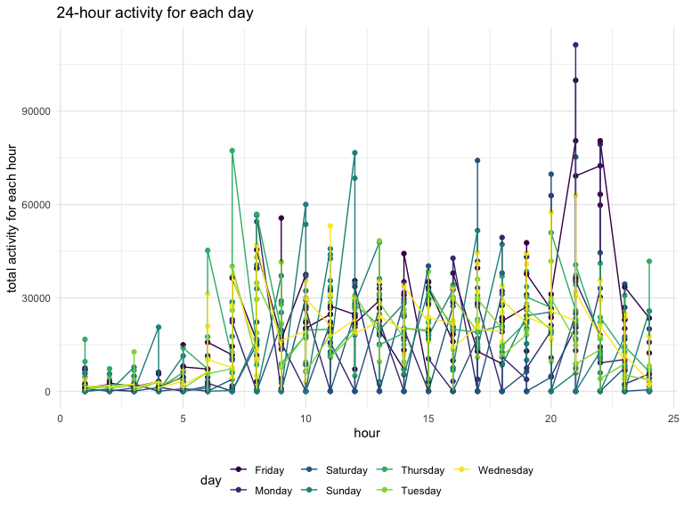

p8105\_hw3\_jl5548
================
J L
October 14, 2019

Problem 1
---------

**Preparation**

``` r
## Load data and view
library(p8105.datasets)
data("instacart")
instacart
```

    ## # A tibble: 1,384,617 x 15
    ##    order_id product_id add_to_cart_ord… reordered user_id eval_set
    ##       <int>      <int>            <int>     <int>   <int> <chr>   
    ##  1        1      49302                1         1  112108 train   
    ##  2        1      11109                2         1  112108 train   
    ##  3        1      10246                3         0  112108 train   
    ##  4        1      49683                4         0  112108 train   
    ##  5        1      43633                5         1  112108 train   
    ##  6        1      13176                6         0  112108 train   
    ##  7        1      47209                7         0  112108 train   
    ##  8        1      22035                8         1  112108 train   
    ##  9       36      39612                1         0   79431 train   
    ## 10       36      19660                2         1   79431 train   
    ## # … with 1,384,607 more rows, and 9 more variables: order_number <int>,
    ## #   order_dow <int>, order_hour_of_day <int>,
    ## #   days_since_prior_order <int>, product_name <chr>, aisle_id <int>,
    ## #   department_id <int>, aisle <chr>, department <chr>

**The goal is to do some exploration of this dataset. To that end, write a short description of the dataset, noting the size and structure of the data, describing some key variables, and giving illstrative examples of observations.**

``` r
## Understand variables
str(instacart)
nrow(instacart)
ncol(instacart)
```

The dataset instacart records online grocery orders from Instacart users and contains 1384617 observations of 131,209 unique users. Each row is a product from an order, and each user only place one order in this dataset. There are 15 variables in this dataset:

*order\_id: order identifier *product\_id: product identifier *add\_to\_cart\_order: order in which each product was added to cart *reordered: 1 if this prodcut has been ordered by this user in the past, 0 otherwise *user\_id: customer identifier *eval\_set: which evaluation set this order belongs in (Note that the data for use in this class is exclusively from the “train” eval\_set) *order\_number: the order sequence number for this user (1=first, n=nth) *order\_dow: the day of the week on which the order was placed *order\_hour\_of\_day: the hour of the day on which the order was placed *days\_since\_prior\_order: days since the last order, capped at 30, NA if order\_number=1 *product\_name: name of the product *aisle\_id: aisle identifier *department\_id: department identifier *aisle: the name of the aisle \*department: the name of the department

Among these variables, some of the key variables are reordered, order\_dow, order\_hour\_of\_day, days\_since\_prior\_order, product\_name, and aisle. The variable reordered informs us whether the product has been ordered in the past by the same user. Order\_dow and order\_hour\_of\_day informs us which day of the week and what hour the order was placed, respectively. Days\_since\_prior\_order gives us a sense of the order cycle of a customer. Product\_name and aisle provides us the information of which product and to which aisle the product belong, respectively. For instance, in the observation shown below, the product Bulgarian yogurt (product\_name) from dairy/egg department (department) and yogurt aisle (aisle) was ordered on Thursday (order\_dow) at 10am (order\_hour\_of\_day), 9 days since the same person ordered it last time (days\_since\_prior\_order).

``` r
instacart %>% filter(order_id == 1, product_id == 49302)
```

    ## # A tibble: 1 x 15
    ##   order_id product_id add_to_cart_ord… reordered user_id eval_set
    ##      <int>      <int>            <int>     <int>   <int> <chr>   
    ## 1        1      49302                1         1  112108 train   
    ## # … with 9 more variables: order_number <int>, order_dow <int>,
    ## #   order_hour_of_day <int>, days_since_prior_order <int>,
    ## #   product_name <chr>, aisle_id <int>, department_id <int>, aisle <chr>,
    ## #   department <chr>

**Then, do or answer the following (commenting on the results of each):**

**\* How many aisles are there, and which aisles are the most items ordered from?**

``` r
## reorder the dataframe
df_aisle = instacart %>% 
  arrange(aisle_id, aisle) %>% 
  group_by(aisle_id, aisle) %>% 
  summarize(count = n()) 
most_ordered_aisle = df_aisle %>% 
  filter(count == max(pull(df_aisle, count))) %>% 
  select(aisle)
```

    ## Adding missing grouping variables: `aisle_id`

There are 134 aisles, and aisle \#83, fresh vegetables, are the most items ordered from.

**\* Make a plot that shows the number of items ordered in each aisle, limiting this to aisles with more than 10000 items ordered. Arrange aisles sensibly, and organize your plot so others can read it.**

``` r
plot_aisle = df_aisle %>% 
  filter(count > 10000) %>% 
  ggplot(aes(x = count, y = aisle, size = count, color = count)) +
  geom_point()
plot_aisle
```

 As shown in the plot above, y-axis contains all the aisle names and x-axis contains the corresponding number of items ordered in each aisle (those with more than 10000 items ordered). Number of items ordered in each aisle is represented by the size and color of the points, scale shown in the bottom of the graph.

**\* Make a table showing the three most popular items in each of the aisles “baking ingredients”, “dog food care”, and “packaged vegetables fruits”. Include the number of times each item is ordered in your table.**

``` r
most_popular = instacart %>% 
  filter(aisle == "baking ingredients" | aisle == "dog food care" | aisle == "packaged vegetables fruits") %>% 
  group_by(aisle, product_name) %>% 
  summarize(
    count = n(),
    time_ordered = sum(order_number)
    ) %>% 
  top_n(3, count) %>% 
  arrange(aisle, desc(count), product_name) 
knitr::kable(most_popular)
```

| aisle                      | product\_name                                 |  count|  time\_ordered|
|:---------------------------|:----------------------------------------------|------:|--------------:|
| baking ingredients         | Light Brown Sugar                             |    499|           8605|
| baking ingredients         | Pure Baking Soda                              |    387|           5413|
| baking ingredients         | Cane Sugar                                    |    336|           6244|
| dog food care              | Snack Sticks Chicken & Rice Recipe Dog Treats |     30|            589|
| dog food care              | Organix Chicken & Brown Rice Recipe           |     28|            542|
| dog food care              | Small Dog Biscuits                            |     26|            486|
| packaged vegetables fruits | Organic Baby Spinach                          |   9784|         171301|
| packaged vegetables fruits | Organic Raspberries                           |   5546|         113932|
| packaged vegetables fruits | Organic Blueberries                           |   4966|          86765|

**\* Make a table showing the mean hour of the day at which Pink Lady Apples and Coffee Ice Cream are ordered on each day of the week; format this table for human readers (i.e. produce a 2 x 7 table).**

``` r
weekday = c("Sunday", "Monday", "Tuesday", "Wednesday", "Thursday", "Friday", "Saturday")
mean_hour_ordered = instacart %>%
  filter(product_name == "Pink Lady Apples" | product_name == "Coffee Ice Cream") %>% 
  select(product_name, order_dow, order_hour_of_day) %>% 
  group_by(product_name, order_dow) %>% 
  summarize(
    mean_hour = mean(order_hour_of_day)
  ) %>% 
  mutate(order_dow = weekday[order_dow + 1]) %>% 
  pivot_wider(
    names_from = order_dow,
    values_from = mean_hour
  ) 
knitr::kable(mean_hour_ordered)
```

| product\_name    |    Sunday|    Monday|   Tuesday|  Wednesday|  Thursday|    Friday|  Saturday|
|:-----------------|---------:|---------:|---------:|----------:|---------:|---------:|---------:|
| Coffee Ice Cream |  13.77419|  14.31579|  15.38095|   15.31818|  15.21739|  12.26316|  13.83333|
| Pink Lady Apples |  13.44118|  11.36000|  11.70213|   14.25000|  11.55172|  12.78431|  11.93750|

Problem 2
---------

**Preparation**

``` r
## Load data and view
data("brfss_smart2010")
brfss_smart2010
```

    ## # A tibble: 134,203 x 23
    ##     Year Locationabbr Locationdesc Class Topic Question Response
    ##    <int> <chr>        <chr>        <chr> <chr> <chr>    <chr>   
    ##  1  2010 AL           AL - Jeffer… Heal… Over… How is … Excelle…
    ##  2  2010 AL           AL - Jeffer… Heal… Over… How is … Very go…
    ##  3  2010 AL           AL - Jeffer… Heal… Over… How is … Good    
    ##  4  2010 AL           AL - Jeffer… Heal… Over… How is … Fair    
    ##  5  2010 AL           AL - Jeffer… Heal… Over… How is … Poor    
    ##  6  2010 AL           AL - Jeffer… Heal… Fair… Health … Good or…
    ##  7  2010 AL           AL - Jeffer… Heal… Fair… Health … Fair or…
    ##  8  2010 AL           AL - Jeffer… Heal… Heal… Do you … Yes     
    ##  9  2010 AL           AL - Jeffer… Heal… Heal… Do you … No      
    ## 10  2010 AL           AL - Jeffer… Heal… Unde… Adults … Yes     
    ## # … with 134,193 more rows, and 16 more variables: Sample_Size <int>,
    ## #   Data_value <dbl>, Confidence_limit_Low <dbl>,
    ## #   Confidence_limit_High <dbl>, Display_order <int>,
    ## #   Data_value_unit <chr>, Data_value_type <chr>,
    ## #   Data_Value_Footnote_Symbol <chr>, Data_Value_Footnote <chr>,
    ## #   DataSource <chr>, ClassId <chr>, TopicId <chr>, LocationID <chr>,
    ## #   QuestionID <chr>, RESPID <chr>, GeoLocation <chr>

``` r
## Understand variables
str(brfss_smart2010)
nrow(brfss_smart2010)
ncol(brfss_smart2010)
```

**First, do some data cleaning:**

**\* format the data to use appropriate variable names** **\* focus on the “Overall Health” topic** **\* include only responses from “Excellent” to “Poor”** **\* organize responses as a factor taking levels ordered from “Poor” to “Excellent”**

``` r
df_brfss = brfss_smart2010 %>% 
  janitor::clean_names() %>% 
  separate(locationdesc, into = c("state", "county"), sep = "-") %>% 
  select(-locationabbr) %>% 
  filter(topic == "Overall Health") %>% 
  filter(response == "Poor" | response == "Fair" | response == "Good" | response == "Very Good" | response == "Excellent") %>% 
  mutate(response = factor(response, levels = c("Poor", "Fair", "Good", "Very Good", "Excellent")))
```

**Using this dataset, do or answer the following (commenting on the results of each):**

**\* In 2002, which states were observed at 7 or more locations? What about in 2010?**

``` r
state_2002 = df_brfss %>% 
  filter(year == 2002) %>% 
  group_by(state) %>% 
  distinct(county) %>% 
  summarize(num_location = n()) %>% 
  filter(num_location > 6) %>% 
  pull(state)

state_2010 = df_brfss %>% 
  filter(year == 2010) %>% 
  group_by(state) %>% 
  distinct(county) %>% 
  summarize(num_location = n()) %>% 
  filter(num_location > 6) %>% 
  pull(state)

state_2002
```

    ## [1] "CT " "FL " "MA " "NC " "NJ " "PA "

``` r
state_2010
```

    ##  [1] "CA " "CO " "FL " "MA " "MD " "NC " "NE " "NJ " "NY " "OH " "PA "
    ## [12] "SC " "TX " "WA "

As shown above, CT , FL , MA , NC , NJ , PA were observed at 7 or more locations in 2002, and CA , CO , FL , MA , MD , NC , NE , NJ , NY , OH , PA , SC , TX , WA were observed at 7 or more locations in 2010.

**\* Construct a dataset that is limited to Excellent responses, and contains, year, state, and a variable that averages the data\_value across locations within a state. Make a “spaghetti” plot of this average value over time within a state (that is, make a plot showing a line for each state across years – the geom\_line geometry and group aesthetic will help).**

``` r
# construct the dataset
df_excellent = df_brfss %>%
  filter(response == "Excellent") %>% 
  select(year, state, data_value) %>%  #including year, state, and data_value
  group_by(year, state) %>% 
  summarise(mean_value = mean(data_value, na.rm = TRUE))

# make a "spaghetti" plot
plot_excellent = df_excellent %>% 
  ggplot(aes(x = year, y = mean_value, color = state)) +
  geom_line(alpha = .5) +
  labs(title = "average value over time in different states", 
       y = "average value within a state")

df_excellent
```

    ## # A tibble: 443 x 3
    ## # Groups:   year [9]
    ##     year state mean_value
    ##    <int> <chr>      <dbl>
    ##  1  2002 "AK "       27.9
    ##  2  2002 "AL "       18.5
    ##  3  2002 "AR "       24.1
    ##  4  2002 "AZ "       24.1
    ##  5  2002 "CA "       22.7
    ##  6  2002 "CO "       23.1
    ##  7  2002 "CT "       29.1
    ##  8  2002 "DC "       29.3
    ##  9  2002 "DE "       20.9
    ## 10  2002 "FL "       25.7
    ## # … with 433 more rows

``` r
plot_excellent
```

 As shown above, df\_excellent is the dataset that limits to Excellent responses, and contains year, state, and mean of data\_value across locations within a state. Plot\_excellent is the corresponding "spaghetti" plot, showing each year on the x-axis and the corresponding mean of data\_value within a state in that year on y-axis. To distinguish between different states, each state is labelled by a color.

**\* Make a two-panel plot showing, for the years 2006, and 2010, distribution of data\_value for responses (“Poor” to “Excellent”) among locations in NY State.**

``` r
# construct the dataset
df_two_panel = df_brfss %>%
  filter(state == "NY ") %>% 
  filter(year == 2006 | year == 2010) %>%
  select(year, state, county, data_value, response) %>% 
  group_by(response) 

# make a two-panel plot (density plot)
plot_two_panel = df_two_panel %>% 
  ggplot(aes(x = data_value, fill = response)) +
  geom_density_line() +
  facet_grid(year~response) +  # separate by year and response categories
  labs(title = "distribution of data value for responses among locations in NY state in 2006 and 2010",
       x = "data value")

plot_two_panel
```

 As shown above, plot\_two\_panel is the two-panel plot showing data\_value for responses among locations in NY state for year 2006(top), and 2010(bottom). The x-axis displays data value scale for different responses, and the y-axis shows the density distribution of data value. Each distribution is filled by different colors of each response category.

Problem 3
---------

**Load, tidy, and otherwise wrangle the data. Your final dataset should include all originally observed variables and values; have useful variable names; include a weekday vs weekend variable; and encode data with reasonable variable classes. Describe the resulting dataset (e.g. what variables exist, how many observations, etc).**

``` r
df_accel = read_csv("./data/accel_data.csv") %>% 
  janitor::clean_names() %>% 
  pivot_longer(   # tidy the data, put all activity columns into a variable "minute"
    activity_1:activity_1440,
    names_to = "minute",
    names_prefix = "activity_",
    values_to = "activity_count"
  ) %>% 
  mutate(   # create a weekday vs weekend variable
    week_day = ifelse(day == "Saturday" | day == "Sunday", "weekend", "weekday"),
    minute = as.numeric(minute)  # encode data with reasonable variable class
  ) 
```

    ## Parsed with column specification:
    ## cols(
    ##   .default = col_double(),
    ##   week = col_integer(),
    ##   day_id = col_integer(),
    ##   day = col_character()
    ## )

    ## See spec(...) for full column specifications.

``` r
df_accel
```

    ## # A tibble: 50,400 x 6
    ##     week day_id day    minute activity_count week_day
    ##    <int>  <int> <chr>   <dbl>          <dbl> <chr>   
    ##  1     1      1 Friday      1           88.4 weekday 
    ##  2     1      1 Friday      2           82.2 weekday 
    ##  3     1      1 Friday      3           64.4 weekday 
    ##  4     1      1 Friday      4           70.0 weekday 
    ##  5     1      1 Friday      5           75.0 weekday 
    ##  6     1      1 Friday      6           66.3 weekday 
    ##  7     1      1 Friday      7           53.8 weekday 
    ##  8     1      1 Friday      8           47.8 weekday 
    ##  9     1      1 Friday      9           55.5 weekday 
    ## 10     1      1 Friday     10           43.0 weekday 
    ## # … with 50,390 more rows

The dataset df\_accel records five weeks of accelerometer data collected on a 63 year-old male with BMI 25, who was admitted to the Advanced Cardiac Care Center of Columbia University Medical Center and diagnosed with congestive heart failure (CHF). The dataset has 50400 observations of 6 variables. The variables include:

-   week (which of the five weeks it is recording)
-   day\_id (which day it is since the first day)
-   day (which weekday it is Monday-Sunday)
-   minute (the recording minute in a 24-hour day starting at midnight)
-   activity\_count (the activity counts for the minute)
-   week\_day (whether it is a weekday or weekend)

**Traditional analyses of accelerometer data focus on the total activity over the day. Using your tidied dataset, aggregate accross minutes to create a total activity variable for each day, and create a table showing these totals. Are any trends apparent?**

``` r
total_activity_over_day = df_accel %>% 
  mutate(day_id = recode(day, "Monday" = "1" ,"Tuesday" =  "2", "Wednesday" = "3", "Thursday" = "4", "Friday" = "5", "Saturday" = "6", "Sunday" = "7")) %>% 
  mutate(day_id = as.numeric(day_id) + 7 * (week - 1)) %>% 
  arrange(day_id) %>% 
  select(week, day_id, day, activity_count) %>% 
  group_by(week, day_id, day) %>% 
  summarize(total_activity = sum(activity_count))
knitr::kable(total_activity_over_day)
```

|  week|  day\_id| day       |  total\_activity|
|-----:|--------:|:----------|----------------:|
|     1|        1| Monday    |         78828.07|
|     1|        2| Tuesday   |        307094.24|
|     1|        3| Wednesday |        340115.01|
|     1|        4| Thursday  |        355923.64|
|     1|        5| Friday    |        480542.62|
|     1|        6| Saturday  |        376254.00|
|     1|        7| Sunday    |        631105.00|
|     2|        8| Monday    |        295431.00|
|     2|        9| Tuesday   |        423245.00|
|     2|       10| Wednesday |        440962.00|
|     2|       11| Thursday  |        474048.00|
|     2|       12| Friday    |        568839.00|
|     2|       13| Saturday  |        607175.00|
|     2|       14| Sunday    |        422018.00|
|     3|       15| Monday    |        685910.00|
|     3|       16| Tuesday   |        381507.00|
|     3|       17| Wednesday |        468869.00|
|     3|       18| Thursday  |        371230.00|
|     3|       19| Friday    |        467420.00|
|     3|       20| Saturday  |        382928.00|
|     3|       21| Sunday    |        467052.00|
|     4|       22| Monday    |        409450.00|
|     4|       23| Tuesday   |        319568.00|
|     4|       24| Wednesday |        434460.00|
|     4|       25| Thursday  |        340291.00|
|     4|       26| Friday    |        154049.00|
|     4|       27| Saturday  |          1440.00|
|     4|       28| Sunday    |        260617.00|
|     5|       29| Monday    |        389080.00|
|     5|       30| Tuesday   |        367824.00|
|     5|       31| Wednesday |        445366.00|
|     5|       32| Thursday  |        549658.00|
|     5|       33| Friday    |        620860.00|
|     5|       34| Saturday  |          1440.00|
|     5|       35| Sunday    |        138421.00|

``` r
## To see whether there are any apparent trends, we can plot these data and investigate
plot_trend = total_activity_over_day %>% 
  ggplot(aes(x = day_id, y = total_activity)) + 
  geom_point() +
  geom_line() +
  geom_smooth(se = FALSE) +
  labs(
    title = "trend of total activity over the day",
    x = "day",
    y = "total activity"
  )
```

From the plot, it occurs that the total activity over the day is oscillating in the range of 1440 to 6.859110^{5}. Despite the overall oscillation from day to day, the total activity is generally increasing from day 1 to day 15, and has a sudden drop from day 24 to day 27, and a steep increase from day 27 to day 33. In the end of the record, the total activity has a large drop again.

**Accelerometer data allows the inspection activity over the course of the day. Make a single-panel plot that shows the 24-hour activity time courses for each day and use color to indicate day of the week. Describe in words any patterns or conclusions you can make based on this graph.**

``` r
df_inspection = df_accel %>% 
  mutate(day_id = recode(day, "Monday" = "1" ,"Tuesday" =  "2", "Wednesday" = "3", "Thursday" = "4", "Friday" = "5", "Saturday" = "6", "Sunday" = "7")) %>% 
  mutate(day_id = as.numeric(day_id) + 7 * (week - 1)) %>% 
  arrange(day_id) %>% 
  mutate(hour = ceiling(minute / 60)) %>% 
  select(week, day_id, day, hour, activity_count) %>%
  group_by(week, day_id, day, hour) %>% 
  summarize(total_activity = sum(activity_count))

plot_inspection = df_inspection %>% 
  ggplot(aes(x = hour, y = total_activity, color = day)) +
  geom_point() +
  geom_line() +
  labs(title = "24-hour activity for each day",
       y = "total activity for each hour")

plot_inspection
```



As shown in the plot, this person has relatively small count of activities at the beginning of each day (0-6am). The activity count increases after 6am and generally decreases after 21pm. There is a peak of activity count around 21pm on Friday.
